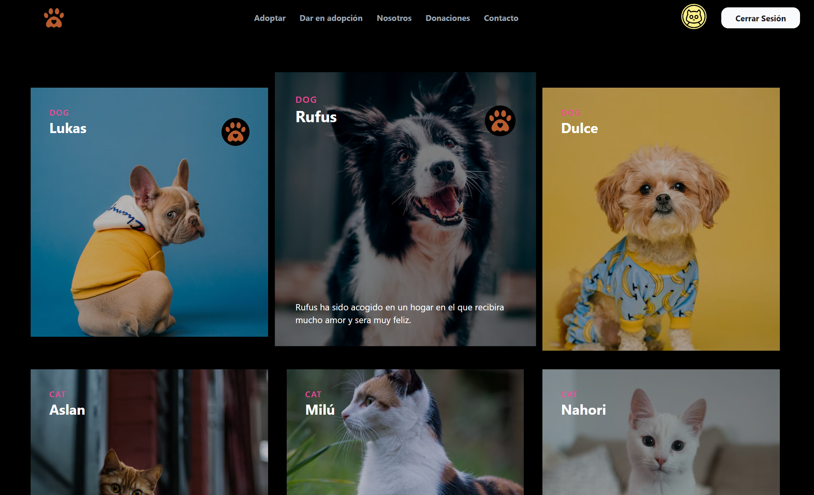

<h1 align="center">
  <br>
  <a href="#"></a>
  <br>
  PetStore
  <br>
</h1>

<h4 align="center">A pet adoption site built on top of <a href="https://vuejs.org" target="_blank">Vue.js</a>.</h4>

<p align="center">
  <a href="#how-to-use">How To Use</a> •
  <a href="#license">License</a> •
  <a href="#live-demo">Live Demo</a>
  
</p>



## How To Use

```bash
# Clone this repository
$ git clone https://github.com/sebastian-crow/petstore

# Go into the repository
$ cd petstore

# Drive
$ open index.html
```

## Live Demo

```bash
 # Netlify
 $ On it
```

## License

MIT

---

> [SebastianCrow](https://github.com/sebastian-crow) <br>

